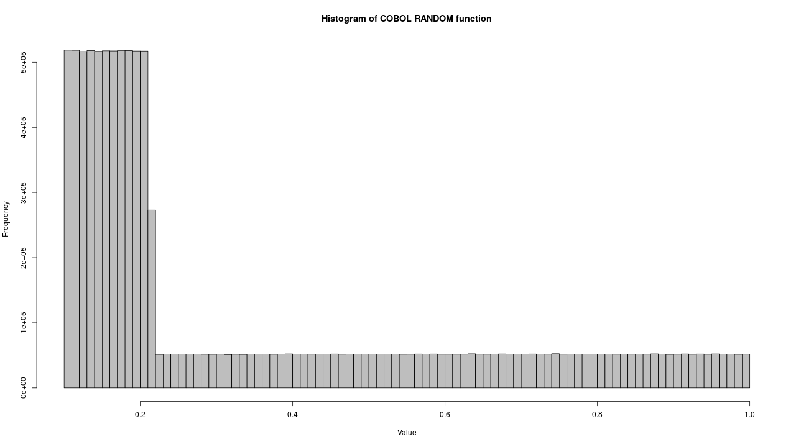

# cobol-rand
Experiment showing that Ubuntu Xenial's open-cobol package has a broken RNG.

One of the things I sometimes like to do with a new programming language is play with generating Pi by various methods.  Since Dr Kirker had already implementend our [canonical Pi exmaple](https://github.com/UCL-RITS/pi_examples/blob/master/cobol_pi_dir/cobol_pi.cbl) I thought I'd do the Monte Carlo version in COBOL.  Unfortunately, I discovered a really interesting bug with the Open Cobol compiler provided as part of the Ubuntu Xenial Universe packages:

```bash
$ dpkg -s open-cobol
Package: open-cobol
Status: install ok installed
Priority: extra
Section: devel
Installed-Size: 553
Maintainer: Ubuntu Developers <ubuntu-devel-discuss@lists.ubuntu.com>
Architecture: amd64
Version: 1.1-1build2
Depends: libc6 (>= 2.14), libcob1, libcob1-dev (= 1.1-1build2), libgmp3-dev, libltdl3-dev, libdb-dev, libncurses5-dev
Description: COBOL compiler
 OpenCOBOL implements substantial part of the COBOL 85 and COBOL 2002
 standards, as well as many extensions of the existent compilers.  OpenCOBOL
 translates COBOL into C and compiles the translated code using GCC.
Homepage: http://www.opencobol.org/
Original-Maintainer: Bart Martens <bartm@debian.org>
$ cobc -V
cobc (OpenCOBOL) 1.1.0
Copyright (C) 2001-2009 Keisuke Nishida / Roger While
Built    Feb 07 2016 10:28:13
Packaged Feb 06 2009 10:30:55 CET
``` 

This bug results in the [RANDOM](http://www.ibm.com/support/knowledgecenter/en/SS6SG3_3.4.0/com.ibm.entcobol.doc_3.4/rlinfrnd.htm) function returning a skewed distribution rather than a uniform one.  This bug has been known about since [at least 2014](https://sourceforge.net/p/open-cobol/bugs/72/) but a fix hasn't made its way into the Ubuntu packages yet.

To show how bad it is, I've written a short COBOL program to generate 10,000,000 random numbers and then used R to plot them.  All the code is provided in this repository.  You can either build/run it by hand, or more simply if you have a system with GNU make installed, just run `make`.

```bash
$ make
cobc -o genrand.exe -x -free genrand.cbl
./genrand.exe > genrand.out
Rscript plot.R
null device 
          1 
```

This wil compile the code with `cobc` and then use R to plot a `histogram.png` like the one below:



As we can see, the skew towards lower values is pretty spectacular.  The net result is that if you are using the compiler that comes out of the Ubuntu repos, you should probably link to C (or better Fortran!) to do your random number generation.
